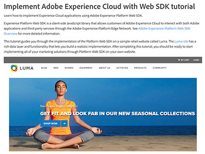

# Tutoriels sur l’Audience Manager

Bienvenue sur le site des tutoriels d’Audience Manager. Utilisation de ces tutoriels avec le [documentation](https://experienceleague.adobe.com/docs/audience-manager/user-guide/aam-home.html) vous permettra de mieux comprendre comment utiliser Adobe Audience Manager pour créer et activer des audiences sur n’importe quel canal ou périphérique à l’aide du meilleur de la classe d’Adobe. [!DNL data management platform].

* **Sélections du personnel** met en évidence certains de nos contenus préférés ;
* Explorez le contenu par rubrique et sous-rubrique dans le **menu de navigation de gauche**
* Utilisez le champ de **recherche** en haut de la page si vous savez ce que vous recherchez

## Nouveautés

* **[Présentation de [!UICONTROL Profile Merge Rules] (Vidéo)](build-and-manage-audiences/profile-merge/overview-of-profile-merge-rules.md)**

   *Comprendre ce qui [!UICONTROL Profile Merge Rules] et leur valeur pour le marketeur.*

* **[[!UICONTROL Profile Merge Rule]Exemples et cas d’utilisation](build-and-manage-audiences/profile-merge/profile-merge-rule-examples-and-use-cases.md)**

   *Dans cette vidéo, vous trouverez des exemples [!UICONTROL Profile Merge Rules] et ce qu’ils signifient, ainsi que les cas pratiques où [!UICONTROL Profile Merge Rules] résoudre pour .*

* **[Création et configuration de destinations basées sur les personnes](data-activation/people-based-destinations/create-and-configure-people-based-destinations.md)**

   *Découvrez comment configurer une [!DNL People-Based Destination] dans l’interface utilisateur d’Audience Manager*

## Sélections du personnel

<table>
<tr>
  <td>
    
    

      <a href="https://experienceleague.adobe.com/docs/platform-learn/implement-web-sdk/overview.html">
    <strong>Tutoriel sur lʼimplémentation dʼAdobe Experience Cloud à lʼaide du SDK web</strong>
    </a>
    

    

    <em>Découvrez comment mettre en oeuvre des applications Experience Cloud à l’aide du SDK Web de Adobe Experience Platform.</em>
    

  </td>
  <td>
    
    

      <a href="https://experienceleague.adobe.com/docs/audience-manager-learn/tutorials/other-integrations/integrating-with-rtcdp/rtcdp-segments-for-aam-users.html">
    <strong>Présentation des segments dans la plateforme des données clients en temps réel pour les utilisateurs d’Audience Manager</strong>
    </a>
    

    

    <em>Cette vidéo présente les différences de création de segments entre l’Audience Manager et la plateforme de données clients en temps réel.</em>
    

  </td>
  <td>
    
    

      <a href="https://experienceleague.adobe.com/docs/audience-manager-learn/tutorials/build-and-manage-audiences/algorithmic-models/configure-and-report-on-predictive-audiences.html">
    <strong>Configuration et création de rapports sur les audiences prédictives dans Audience Manager</strong>
    </a>
    

    

    <em>Dans cette vidéo, nous allons passer en revue la configuration des audiences prédictives dans l’interface d’Audience Manager.</em>
    

  </td>
</tr>
</table>

