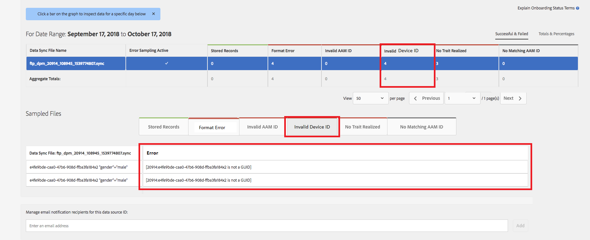

# Validation de l’ID de périphérique global {#global-device-id-validation}

Les identifiants de publicité de périphérique (iDFA, GAID, Roku ID) ont des normes de formatage qui doivent être respectées pour être utilisables dans l’écosystème de publicité numérique. Aujourd’hui, les clients et les partenaires peuvent télécharger des identifiants dans notre version globale [!UICONTROL data sources] dans n’importe quel format sans être avertis de la mise en forme correcte de l’identifiant. Cette fonctionnalité permet de valider les ID de périphérique envoyés à l’interface globale [!UICONTROL data sources] pour une mise en forme correcte et fournit des messages d’erreur lorsque les ID sont mal formatés. Nous prendrons en charge la validation pour [!DNL iDFA], [!DNL Google Advertising] et [!DNL Roku IDs] au lancement.

## Présentation des normes de format {#overview-of-format-standards}

Voici les pools d’ID de publicité de périphériques qui sont actuellement reconnus et pris en charge par AAM. Elles sont mises en oeuvre en tant que partagées [!UICONTROL Data Sources] pouvant être utilisées par tout client ou partenaire de données qui utilise des données liées à des utilisateurs de ces plateformes.

<table>
  <tr>
   <td>Plate-forme </td>
   <td>ID de source de données AAM </td>
   <td>Format d’ID </td>
   <td>aam PID </td>
   <td>Remarques </td>
  </tr>
  <tr>
   <td>Google Android (GAID)</td>
   <td>20914</td>
   <td>32 nombres hexadécimaux, généralement présentés comme<em>exemple 8-4-4-4-12, 97987bca-ae59-4c7d-94ba-ee4f19ab8c21  </em> </td>
   <td>1352</td>
   <td>Cet ID doit être collecté dans un formulaire brut/non haché/non modifié Référence - <a href="https://play.google.com/about/monetization-ads/ads/ad-id/">https://play.google.com/about/monetization-ads/ads/ad-id/</a></td>
  </tr>
  <tr>
   <td>Apple iOS (IDFA)</td>
   <td>20915</td>
   <td>Numéros 32 hexadécimaux, généralement présentés comme <em>exemple 8-4-4-4-12, 6D92078A-8246-4BA4-AE5B-76104861E7DC  </em> </td>
   <td>3560</td>
   <td>Cet ID doit être collecté dans un formulaire brut/non haché/non modifié Référence - <a href="https://support.apple.com/en-us/HT205223">https://support.apple.com/en-us/HT205223</a></td>
  </tr>
  <tr>
   <td>Roku (RIDA)</td>
   <td>121963</td>
   <td>32 nombres hexadécimaux, généralement présentés comme <em>exemple 8-4-4-4-12,</em> <em>fcb2a29c-315a-5e6b-bcfd-d889ba19aada</em></td>
   <td>11536</td>
   <td>Cet ID doit être collecté dans un formulaire brut/non haché/non modifié Référence - <a href="https://sdkdocs.roku.com/display/sdkdoc/Roku+Advertising+Framework">https://sdkdocs.roku.com/display/sdkdoc/Roku+Advertising+Framework</a> </td>
  </tr>
  <tr>
   <td>ID de publicité Microsoft (MAID)</td>
   <td>389146</td>
   <td>Chaîne numérique alphanumérique</td>
   <td>14593</td>
   <td>Cet ID doit être collecté dans un formulaire brut/non haché/non modifié Référence - <a href="https://docs.microsoft.com/en-us/uwp/api/windows.system.userprofile.advertisingmanager.advertisingid">https://docs.microsoft.com/en-us/uwp/api/windows.system.userprofile.advertisingmanager.</a> <a href="https://msdn.microsoft.com/en-us/library/windows/apps/windows.system.userprofile.advertisingmanager.advertisingid.aspx">advertisingidhttps://msdn.microsoft.com/en-us/library/windows/apps/windows.system.userprofile.advertisingmanager.advertisingid.aspx</a></td>
  </tr>
  <tr>
   <td>Samsung DUID</td>
   <td>404660</td>
   <td>Exemple de chaîne numérique Alpha, 7XCBNROQJQPYW</td>
   <td>15950</td>
   <td>Cet ID doit être collecté dans un formulaire brut/non haché/non modifié Référence - <a href="https://developer.samsung.com/tv/develop/api-references/samsung-product-api-references/productinfo-api">https://developer.samsung.com/tv/develop/api-references/samsung-product-api-references/productinfo-api</a> </td>
  </tr>
</table>

## Définition d’un identifiant de publicité dans l’application {#setting-an-advertising-identifier-in-the-app}

La définition de l’identifiant de l’annonceur dans l’application est en fait un processus en deux étapes, d’abord en récupérant l’identifiant de l’annonceur, puis en l’envoyant à l’Experience Cloud. Vous trouverez ci-dessous des liens pour effectuer ces étapes.

1. Récupération de l’ID
   1. [!DNL Apple] vous trouverez des informations sur le [!DNL advertising ID] site [ICI](https://developer.apple.com/documentation/adsupport/asidentifiermanager).
   1. Vous trouverez [!DNL advertiser ID] ICI [!DNL Android] quelques informations sur la configuration de la [pour](http://www.androiddocs.com/google/play-services/id.html)les développeurs.
1. L’envoyer à l’Experience Cloud à l’aide de la [!DNL setAdvertisingIdentifier] méthode du SDK
   1. Les informations à utiliser `setAdvertisingIdentifier` se trouvent dans la [documentation](https://aep-sdks.gitbook.io/docs/using-mobile-extensions/mobile-core/identity/identity-api-reference#set-an-advertising-identifier) pour [!DNL iOS] et [!DNL Android].

`// iOS (Swift) example for using setAdvertisingIdentifier:`
`ACPCore.setAdvertisingIdentifier([AdvertisingId]) // ...where [AdvertisingId] is replaced by the actual advertising ID`

## Message d’erreur DCS pour les ID incorrects  {#dcs-error-messaging-for-incorrect-ids}

Lorsqu’un ID de périphérique global incorrect (IDFA, GAID, etc.) est envoyé en temps réel à l’Audience Manager, un code d’erreur est renvoyé sur l’accès. Voici un exemple d’erreur renvoyée, car l’identifiant est envoyé sous la forme d’un [!DNL Apple IDFA]code, qui ne doit contenir que des majuscules, et pourtant, un &quot;x&quot; minuscule apparaît dans l’identifiant.

Consultez la [documentation](https://experienceleague.adobe.com/docs/audience-manager/user-guide/api-and-sdk-code/dcs/dcs-api-reference/dcs-error-codes.html?lang=en#api-and-sdk-code) relative à la liste des codes d&#39;erreur.

## Intégration d’ID de périphérique global {#onboarding-global-device-ids}

Outre l’envoi en temps réel des identifiants de périphérique global, vous pouvez également &quot;[!DNL onboard]&quot; (télécharger) des données par rapport aux identifiants. Ce processus est le même que lorsque vous incorporez des données par rapport à vos identifiants de client (généralement par le biais de paires clé/valeur), mais vous utiliseriez simplement les identifiants de source de données appropriés, de sorte que les données soient affectées à l’identifiant global de périphérique. La documentation relative au processus d’intégration se trouve dans la [documentation](https://experienceleague.adobe.com/docs/audience-manager/user-guide/implementation-integration-guides/sending-audience-data/batch-data-transfer-process/batch-data-transfer-overview.html?lang=en#implementation-integration-guides). N’oubliez pas d’utiliser l’ [!UICONTROL data source] identifiant global, en fonction de la plate-forme que vous utilisez.

Si des ID de périphérique global incorrects sont envoyés lors du processus d’intégration, les erreurs s’affichent dans le [[!DNL Onboarding Status Report]](https://experienceleague.adobe.com/docs/audience-manager/user-guide/reporting/onboarding-status-report.html?lang=en#reporting)rapport.

Voici un exemple d’erreur qui résulterait de ce rapport :

