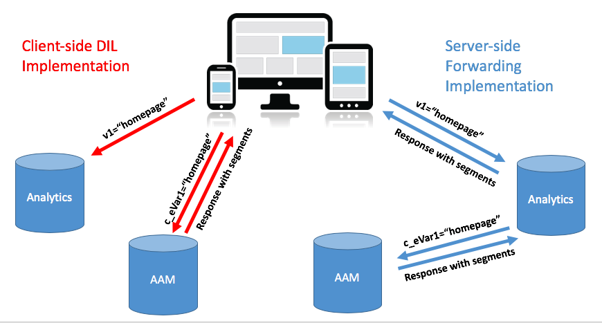
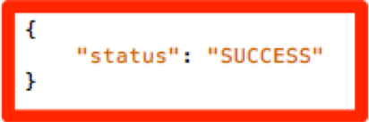

# Migration de l’implémentation de l’Audience Manager de votre site du DIL côté client vers le transfert côté serveur {#migrating-your-site-s-aam-implementation-from-client-side-dil-to-server-side-forwarding}

Ce tutoriel s’applique à vous si vous disposez à la fois de Adobe Audience Manager (AAM) et d’Adobe Analytics et que vous envoyez actuellement un accès de la page à AAM à l’aide de DIL ([!DNL Data Integration Library]) et envoyer également un accès de la page à Adobe Analytics. Puisque vous disposez de ces deux solutions et qu’elles font toutes deux partie de Adobe Experience Cloud, vous avez la possibilité de suivre la bonne pratique consistant à activer le transfert côté serveur, ce qui active la variable [!DNL Analytics] serveurs de collecte de données pour transférer les données d’analyse de site en temps réel vers l’Audience Manager, au lieu de faire envoyer un accès supplémentaire de la page à AAM au code côté client. Ce tutoriel vous guide tout au long des étapes permettant de passer de l’ancienne mise en oeuvre du DIL côté client à la nouvelle méthode de transfert côté serveur.

## Côté client (DIL) et côté serveur {#client-side-dil-vs-server-side}

Lors de la comparaison et de la comparaison de ces deux méthodes pour obtenir des données Adobe Analytics dans AAM, il peut s’avérer utile de visualiser les différences dans l’image suivante :

### Mise en oeuvre du DIL côté client {#client-side-dil-implementation}

Si vous utilisez cette méthode pour obtenir des données Adobe Analytics dans AAM, deux accès proviennent de vos pages Web : L’une d’entre elles [!DNL Analytics]et l’un d’eux AAM (après avoir copié la variable [!DNL Analytics] données de la page Web. [!UICONTROL Segments] sont renvoyés d’AAM à la page, où ils peuvent être utilisés pour la personnalisation, etc. Cette opération est considérée comme une implémentation héritée et n’est plus recommandée.

Outre le fait qu’il ne s’agit pas de suivre les bonnes pratiques, l’utilisation de cette méthode présente les inconvénients suivants :

* Deux accès provenant de la page au lieu d’un seul
* le transfert côté serveur est nécessaire pour le partage en temps réel des audiences AAM vers [!DNL Analytics], de sorte que les mises en oeuvre côté client ne prennent pas en charge cette fonctionnalité (et potentiellement d’autres fonctionnalités à l’avenir).

Il est recommandé de passer à une méthode de transfert côté serveur de mise en oeuvre AAM.

### Mise en oeuvre du transfert côté serveur {#server-side-forwarding-implementation}

Comme illustré dans l’image ci-dessus, un accès provient de la page Web vers Adobe Analytics. [!DNL Analytics] transfère ensuite ces données à AAM en temps réel et les visiteurs sont évalués en AAM caractéristiques et [!UICONTROL segments], comme si l’accès provenait directement de la page.

[!UICONTROL Segments] sont renvoyés lors du même accès en temps réel à [!DNL Analytics], qui transfère la réponse vers la page Web pour la personnalisation, etc.

Il n’y a aucun inconvénient à ce que le transfert côté serveur soit effectué. Adobe recommande vivement à toute personne qui dispose à la fois d’une Audience Manager et d’ [!DNL Analytics] utilise cette méthode de mise en oeuvre.

## Vous avez deux tâches principales : {#you-have-two-main-tasks}

Il y a pas mal d&#39;informations sur cette page, et c&#39;est important, bien sûr. Cependant, il **tout se résume à deux choses principales que vous devez faire.**:

1. Remplacez le code du DIL côté client par le code de transfert côté serveur.
1. Retourner le commutateur dans la [!DNL Analytics] [!DNL Admin Console] pour démarrer le transfert réel des données (par [!UICONTROL report suite])

Si vous ignorez l’une de ces tâches, le transfert côté serveur ne fonctionnera pas correctement. Des étapes et des données supplémentaires ont été ajoutées à ce document pour vous aider à effectuer ces deux étapes correctement pour votre configuration.

## Options de mise en oeuvre {#implementation-options}

Lorsque vous passez du transfert côté client au transfert côté serveur, l’une des tâches qui s’affiche est de modifier le code en nouveau code de transfert côté serveur. Pour ce faire, utilisez l’une des options suivantes :

* Balises Adobe Experience Platform : option d’implémentation recommandée par Adobe pour les propriétés web. Vous verrez que c’est une tâche facile, car les balises Platform ont fait tout le travail pour vous.
* Sur la page : vous pouvez également placer le nouveau code SSF directement dans la variable `doPlugins` à l’intérieur de votre fonction `appMeasurement.js` si vous n’utilisez pas (encore) Adobe Launch
* Autres gestionnaires de balises : ils peuvent être traités comme l’option précédente (Sur la page), car vous allez toujours placer le code SSF dans `doPlugins`, où l’autre gestionnaire de balises stocke le [!DNL AppMeasurement] code

Nous allons voir chacun de ces éléments ci-dessous dans la section _Mise à jour du code_ .

## Etapes de mise en oeuvre {#implementation-steps}

Les étapes suivantes décrivent la mise en oeuvre.

### Étape 0 : Condition requise : Service d’ID Experience Cloud (ECID) {#step-prerequisite-experience-cloud-id-service-ecid}

La mise en oeuvre du service d’ID Experience Cloud est la condition principale du passage au transfert côté serveur. Cela est plus facile si vous utilisez Experience Platform Launch, auquel cas vous installez simplement l’extension ECID et cela fera le reste.

Si vous utilisez un TMS non Adobe, ou aucun TMS du tout, implémentez ECID pour exécuter. **before** toute autre solution d’Adobe. Voir [Documentation ECID](https://experienceleague.adobe.com/docs/id-service/using/home.html) pour plus d’informations. La seule autre condition préalable concerne les versions de code. Par conséquent, comme vous appliquez simplement les versions les plus récentes du code dans les étapes suivantes, tout ira bien.

>[!NOTE]
>
>Veuillez lire l’intégralité de ce document avant de procéder à l’implémentation. La section &quot;Minutage&quot; ci-dessous contient des informations importantes sur la *when* vous devez mettre en oeuvre chaque élément, y compris l’ECID (s’il n’est pas encore mis en oeuvre).

### Étape 1 : Enregistrer les options actuellement utilisées du code DIL {#step-record-currently-used-options-from-dil-code}

Lorsque vous vous préparez à passer du code du DIL côté client au transfert côté serveur, la première étape consiste à identifier tout ce que vous faites avec le code du DIL, y compris les paramètres personnalisés et les données envoyées à AAM. Voici quelques éléments à noter et à prendre en compte :

* Normal [!DNL Analytics] , à l’aide de la variable `siteCatalyst.init` Module de DIL : il n’est pas nécessaire de vous soucier de celui-ci, car son travail consiste simplement à envoyer la [!DNL Analytics] et cela se produit simplement en activant le transfert côté serveur.
* Sous-domaine du partenaire : dans `DIL.create` , notez la fonction `partner` . Il s’agit de votre &quot;sous-domaine partenaire&quot; ou, parfois, de votre &quot;identifiant partenaire&quot;. Il sera nécessaire lorsque vous placez le nouveau code de transfert côté serveur.
* [!DNL Visitor Service Namespace] - Également appelé votre[!DNL Org ID]&quot; ou &quot;[!DNL IMS Org ID],&quot; vous en aurez également besoin lorsque vous configurerez le nouveau code de transfert côté serveur. Fais-en une note !
* containerNSID, uuidCookie et autres options avancées - Notez toutes les options avancées supplémentaires que vous utilisez afin de pouvoir les définir également dans le code de transfert côté serveur.
* Variables de page supplémentaires : si d’autres variables sont envoyées à l’AAM à partir de la page (en plus de la variable [!DNL Analytics] variables gérées par siteCatalyst.init), vous devez en prendre note afin qu’elles puissent être envoyées via le transfert côté serveur (alerte de spoiler : via [!DNL contextData] ).

### Étape 2 : Mettre à jour le code {#step-updating-the-code}

Dans [Options de mise en oeuvre](#implementation-options) (ci-dessus) plusieurs options sont fournies concernant la manière dont et l’emplacement de l’implémentation du transfert côté serveur. Pour que cette section soit efficace, nous devons la diviser en deux sections (dont deux combinées). Accédez à la méthode de cette section qui décrit le mieux vos besoins.

#### Balises Adobe Experience Platform {#launch-by-adobe}

Regardez la vidéo ci-dessous pour en savoir plus sur le déplacement des options de mise en oeuvre du code du DIL côté client vers le transfert côté serveur dans Experience Platform Launch.

>[!VIDEO](https://video.tv.adobe.com/v/26310/?quality=12)

#### &quot;Sur la page&quot; ou gestionnaire de balises non Adobe {#on-the-page-or-non-adobe-tag-manager}

Regardez la vidéo ci-dessous pour en savoir plus sur le déplacement des options de mise en oeuvre du code du DIL côté client vers le transfert côté serveur dans [!DNL AppMeasurement] , résidant dans un fichier ou dans un système de gestion des balises non Adobe.

>[!VIDEO](https://video.tv.adobe.com/v/26312/?quality=12)

### Étape 3 : Activation du transfert (par [!UICONTROL Report Suite]) {#step-enabling-the-forwarding-per-report-suite}

Jusqu’à présent, dans ce tutoriel, nous avons passé tout notre temps à changer le code du DIL côté client en transfert côté serveur. C&#39;est bien, parce que c&#39;est la partie la plus difficile. Bien que cette section soit très facile à voir, elle est tout aussi importante que la mise à jour du code. Dans cette vidéo, vous allez découvrir comment changer le commutateur qui permet le transfert réel des données d’Analytics vers l’Audience Manager.

>[!VIDEO](https://video.tv.adobe.com/v/26355/?quality-12)

**REMARQUE :** Comme indiqué dans la vidéo, n’oubliez pas que jusqu’à 4 heures seront nécessaires pour que l’activation du transfert soit entièrement mise en oeuvre sur le serveur principal Experience Cloud.

## Minutage {#timing}

Pour rappel, il existe deux tâches principales pour passer du DIL côté client au transfert côté serveur :

1. Mise à jour du code
1. Changement de sélecteur dans la variable [!DNL Analytics] [!DNL Admin Console]

Mais la question est, laquelle faites-vous en premier ? Est-ce important ? OK, désolé, c&#39;était deux questions. Mais les réponses sont... ça dépend, et oui, ça dépend *can* matière. En quoi est-ce vague ? Faisons une ventilation. Mais commencez par une question supplémentaire qui peut s’afficher si vous êtes une grande organisation avec de nombreux sites : Dois-je tout faire en même temps ? Celle-là est un peu plus facile. Non. Vous pouvez le faire morceau par morceau.

### Une plongée un peu plus profonde {#a-little-deeper-dive}

La raison pour laquelle le délai et la commande sont importants est la manière dont le transfert est effectué. _vraiment_ fonctionne, qui peut être résumé dans les quelques faits techniques suivants :

* Si le service d’ID d’Experience Cloud (ECID) est mis en oeuvre et que le commutateur se trouve dans la variable [!DNL Analytics] [!DNL Admin Console] (&quot;le commutateur&quot;) est activé, les données seront transférées à partir de [!DNL Analytics] à AAM, même si vous n’avez pas encore mis à jour le code.
* Si ECID n’est pas implémenté, les données ne seront pas transférées, même si le commutateur est activé, et que le code de transfert côté serveur est activé.
* Le code de transfert côté serveur (que ce soit dans les balises Platform ou sur la page) gère réellement la réponse et est nécessaire pour terminer la migration.
* N’oubliez pas que le commutateur de transfert côté serveur est activé par la variable [!UICONTROL report suite], mais que le code est géré par la propriété dans les balises Platform, ou par la propriété [!DNL AppMeasurement] si vous n’utilisez pas de balises Platform.

### Bonnes pratiques {#best-practices}

Sur la base de ces détails techniques, voici les recommandations pour connaître le moment et le moment où :

#### Si vous n’avez PAS encore implémenté ECID {#if-you-do-not-have-ecid-yet-implemented}

1. Basculer [!DNL Analytics] pour chaque [!UICONTROL report suite] que vous activerez pour le transfert côté serveur.

   1. Le transfert ne démarre pas encore car vous ne disposez pas d’ECID.

1. Par site, mettez à jour votre code du DIL côté client vers le transfert côté serveur (il peut s’agir de balises Platform) ou sur la page, comme expliqué dans une autre section ci-dessus).

   1. Le transfert des flux actuels (comme vous avez ajouté l’ECID) et vous devriez également recevoir une réponse JSON appropriée à votre [!DNL Analytics] balise (voir la section Validation et dépannage ci-dessous pour plus d’informations).

#### Si ECID est implémenté {#if-you-do-have-ecid-implemented}

1. Préparez et planifiez afin que vous soyez prêt à mettre à jour votre code du DIL au transfert côté serveur PER [!UICONTROL report suite] que vous activez pour le transfert côté serveur :

   1. Basculer [!DNL Analytics] pour activer le transfert côté serveur.

      1. Le transfert commencera car ECID est activé.
   1. Dans les plus brefs délais, mettez à jour votre code du DIL côté client vers le transfert côté client (il peut s’agir de balises Platform ou de la page, comme expliqué dans une autre section ci-dessus).

      1. Vous devriez recevoir une réponse JSON appropriée à votre [!DNL Analytics] (voir [Validation et dépannage](#validation-and-troubleshooting) pour plus d’informations).

>[!NOTE]
>
>Il est important de réaliser ces deux étapes aussi près que possible, car entre les étapes 1 et 2 ci-dessus, vous aurez une duplication des données en AAM. En d’autres termes, le transfert côté unique a commencé à envoyer des données à partir de [!DNL Analytics] à AAM, et comme le code du DIL se trouve toujours sur la page, un accès se déplace directement de la page vers AAM, ce qui double les données. Dès que vous mettez à jour le code du transfert DIL vers le transfert côté serveur, cela sera moins important.

>[!NOTE]
>
>Si vous préférez une légère incohérence des données plutôt qu’une petite duplication des données, vous pouvez changer l’ordre des étapes 1 et 2 ci-dessus. Le déplacement du code du DIL vers le transfert côté serveur arrête le flux de données vers AAM jusqu’à ce que vous puissiez actionner le commutateur pour activer le transfert côté serveur pour le [!UICONTROL report suite]. En règle générale, les clients préfèrent avoir un petit doublement de données plutôt que de ne pas intégrer les visiteurs aux caractéristiques et [!UICONTROL segments].

#### minutage de migration lorsque vous disposez de plusieurs sites et [!UICONTROL report suites] {#migration-timing-when-you-have-many-sites-and-report-suites}

Cette rubrique est brièvement abordée dans les sections précédentes, dans la mesure où la stratégie principale peut être résumée comme suit :

Migration d’un site/[!UICONTROL report suite] (ou groupe de sites/[!UICONTROL report suites]) à la fois.

Cependant, cela peut devenir un peu délicat en fonction de quelques scénarios possibles :

* Vous disposez d’un site qui contient plusieurs [!UICONTROL report suites]
* Vous avez une [!UICONTROL report suite] qui comprend plusieurs sites (comme une variable globale [!UICONTROL report suite])
* Vous utilisez une propriété de balises Platform pour couvrir plusieurs sites.
* Vous disposez de différentes équipes de développement pour différents sites.

A cause de ces éléments, ça peut devenir un peu compliqué. Les meilleures choses que je puisse suggérer sont les suivantes :

* Prenez le temps d’élaborer une stratégie de migration vers le transfert côté serveur, en fonction des éléments expliqués ci-dessus.
* Basé sur le fait qu’une seule propriété dans les balises Platform (ou une seule [!DNL AppMeasurement] (fichier) correspond généralement à 1 ou 2 distinct [!UICONTROL report suites], vous serez probablement en mesure d’élaborer un plan qui fonctionne sur ces groupes distincts un par un, en mettant à jour votre entreprise vers le transfert côté serveur.
* Si vous travaillez avec Adobe Consulting, contactez-le au sujet de votre plan de migration, afin qu’il puisse vous aider si nécessaire.

## Validation et dépannage {#validation-and-troubleshooting}

La principale façon de vérifier que le transfert côté serveur est opérationnel consiste à examiner la réponse à l’un de vos accès Adobe Analytics provenant de l’application.

Si vous n’effectuez pas de transfert côté serveur des données depuis [!DNL Analytics] en Audience Manager, il n&#39;y a vraiment pas de réponse à la [!DNL Analytics] balise (outre un pixel 2x2). Cependant, si vous effectuez un transfert côté serveur, vous pouvez vérifier certains éléments dans la variable [!DNL Analytics] demande et réponse qui vous informeront que [!DNL Analytics] communique correctement avec l’Audience Manager, transfère l’accès et obtient une réponse.

>[!VIDEO](https://video.tv.adobe.com/v/26359/?quality=12)

>[!WARNING]
>
>Attention au faux &quot;Succès&quot;. Si une réponse s’affiche et que tout semble fonctionner, assurez-vous que vous disposez de la variable `stuff` dans la réponse. Si ce n’est pas le cas, un message s’affiche : `"status":"SUCCESS"`. Aussi fou que cela paraisse, c&#39;est en fait la preuve qu&#39;il ne fonctionne PAS correctement.
>
>Si cela s’affiche, cela signifie que vous avez terminé la mise à jour du code dans les balises Platform ou [!DNL AppMeasurement], mais que le transfert dans le [!DNL Analytics] [!DNL Admin Console] n’est pas encore terminé. Dans ce cas, vous devez vérifier que vous avez activé le transfert côté serveur dans la variable [!DNL Analytics] [!DNL Admin Console] pour votre [!UICONTROL report suite]. Si vous l&#39;avez fait, et que cela n&#39;a pas encore été 4 heures, soyez patient, car cela peut prendre autant de temps pour apporter toutes les modifications nécessaires sur le serveur principal.

Pour plus d’informations sur le transfert côté serveur, reportez-vous à la section [documentation](https://experienceleague.adobe.com/docs/analytics/admin/admin-tools/server-side-forwarding/ssf.html).
