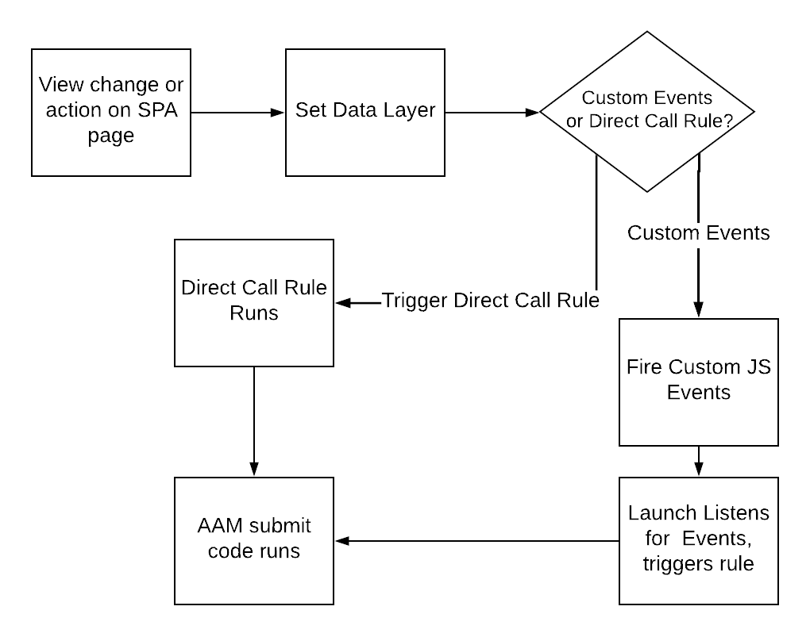

# Utilisation des bonnes pratiques sur SPA pages lors de l’envoi de données à AAM {#using-best-practices-on-spa-pages-when-sending-data-to-aam}

Ce document décrit plusieurs bonnes pratiques pour envoyer des données depuis des applications d’une seule page (SPA) vers Adobe Audience Manager (AAM). Cet article se concentre sur l’utilisation de [!UICONTROL Experience Platform tags], méthode de mise en oeuvre recommandée.

## Notes initiales

* Les éléments ci-dessous vont supposer que vous utilisez des balises Platform pour implémenter sur votre site. Les considérations existent toujours si vous n’utilisez pas les balises Platform, mais vous devez les adapter à votre méthode de mise en oeuvre.
* Tous les SPA sont différents. Par conséquent, vous devrez peut-être ajuster certains des éléments suivants pour mieux répondre à vos besoins, mais Adobe souhaite partager certaines bonnes pratiques auxquelles vous devez réfléchir pendant l’envoi de données de SPA pages à l’Audience Manager.

## Schéma simple de l’utilisation de SPA et d’AAM dans les balises Experience Platform (anciennement Launch){#simple-diagram-of-working-with-spas-and-aam-in-experience-platform-launch}

>[!NOTE]
>Comme indiqué, il s’agit d’un diagramme simplifié de la manière dont SPA pages sont gérées dans une mise en oeuvre Adobe Audience Manager (sans Adobe Analytics) à l’aide de balises Platform. Comme vous pouvez le voir, c&#39;est assez simple, avec la grande décision étant comment vous allez communiquer un changement d&#39;affichage (ou une action) aux balises Platform.

## Déclenchement des balises à partir de la page SPA {#triggering-launch-from-the-spa-page}

Deux des méthodes les plus courantes pour déclencher une règle dans les balises Platform (et donc envoyer des données en Audience Manager) sont les suivantes :

* Définition d’événements personnalisés JavaScript (voir exemple [ICI](https://helpx.adobe.com/analytics/kt/using/spa-analytics-best-practices-feature-video-use.html) avec Adobe Analytics)
* Utilisation d’une [!UICONTROL Direct Call Rule]

Dans cet exemple d’Audience Manager, vous utilisez une [!UICONTROL Direct Call rule] dans les balises Platform pour déclencher l’accès en cours d’Audience Manager. Comme vous le verrez dans les sections suivantes, cela s’avère utile en définissant la variable [!UICONTROL Data Layer] à une nouvelle valeur afin qu’elle puisse être récupérée par la variable [!UICONTROL Data Element] dans les balises Platform.

## Page de démonstration {#demo-page}

Voici une petite page qui montre comment modifier une valeur dans la couche de données et l’envoyer en Audience Manager, comme vous pouvez le faire sur une page SPA. Cette fonctionnalité peut être modélisée pour des modifications plus élaborées nécessaires. Vous trouverez cette page de démonstration [ICI](https://aam.enablementadobe.com/SPA-Launch.html).

## Définition de la couche de données {#setting-the-data-layer}

Comme mentionné, lorsque du nouveau contenu est chargé sur la page ou lorsqu’une personne effectue une action sur le site, la couche de données doit être définie dynamiquement dans l’en-tête de la page AVANT que les balises Platform ne soient appelées et n’exécutent le [!UICONTROL rules], afin que les balises Platform puissent sélectionner les nouvelles valeurs de la couche de données et les envoyer en Audience Manager.

Si vous accédez au site de démonstration répertorié ci-dessus et que vous consultez la source de la page, vous verrez :

* La couche de données se trouve dans l’en-tête de la page, avant l’appel aux balises Platform.
* Le code JavaScript du lien SPA simulé modifie la variable [!UICONTROL Data Layer], puis appelle les balises Platform (la variable `_satellite.track()` ). Si vous utilisiez des événements personnalisés JavaScript au lieu de [!UICONTROL Direct Call Rule], la leçon est la même. Modifiez d’abord la variable [!DNL data layer], puis appelez des balises Platform.

>[!VIDEO](https://video.tv.adobe.com/v/23322/?quality=12)

## Ressources supplémentaires {#additional-resources}

* [SPA discussion sur les forums de l&#39;Adobe](https://forums.adobe.com/thread/2451022)
* [Sites de l’architecture de référence pour montrer comment mettre en oeuvre SPA dans les balises Platform](https://helpx.adobe.com/experience-manager/kt/integration/using/launch-reference-architecture-SPA-tutorial-implement.html)
* [Utilisation des bonnes pratiques lors du suivi des SPA dans Adobe Analytics](https://helpx.adobe.com/analytics/kt/using/spa-analytics-best-practices-feature-video-use.html)
* [Site de démonstration utilisé pour cet article](https://aam.enablementadobe.com/SPA-Launch.html)
